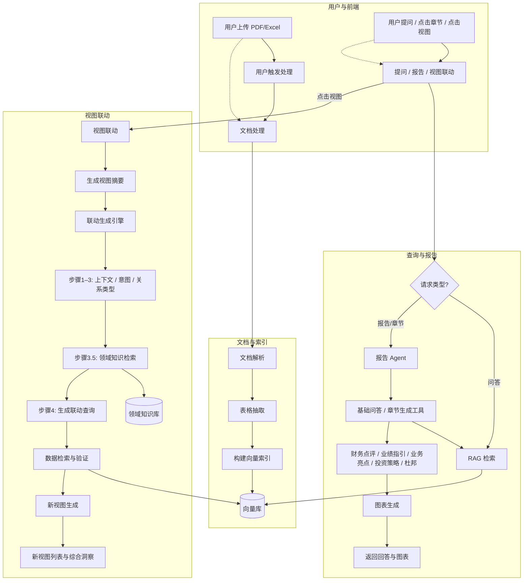
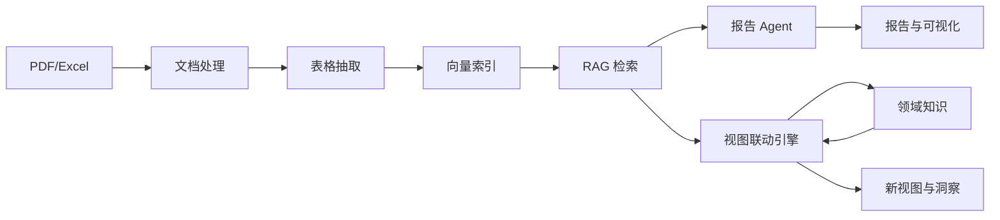
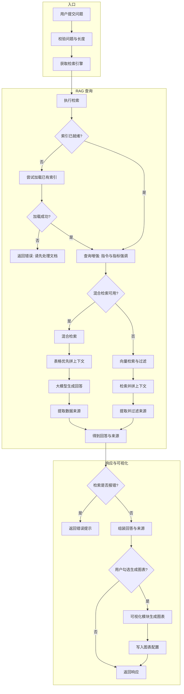
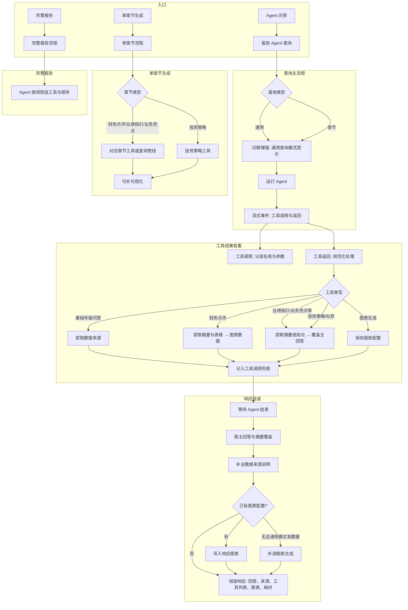

# LlamaReport 项目研究方法与框架

## 一、项目概述

**LlamaReport** 是一个基于大语言模型（LLM）与检索增强生成（RAG）的**财务年报智能分析系统**。系统支持 PDF/Excel 文档上传、表格提取、向量索引构建、自然语言问答、多章节报告生成（财务点评、业绩指引、业务亮点、投资策略）、杜邦分析、可视化图表生成以及**视图联动**（从单一视图衍生相关视图与深度洞察）。研究方法围绕「文档—检索—推理—生成—联动」的闭环设计，结合领域知识注入与多 Agent 协作完成分析任务。

---

## 二、研究方法

### 2.1 总体思路

- **数据驱动**：以年报 PDF/Excel 为唯一数据源，通过文档解析与表格抽取得到结构化与半结构化内容，再经向量化与索引供检索。
- **检索增强（RAG）**：用户问题与章节生成均依赖 RAG 检索，先取相关片段与表格再生成回答，保证内容可追溯、可验证。
- **Agent 编排**：采用 Function Agent（LlamaIndex）协调多工具（章节生成、数据检索、可视化、杜邦分析），由 LLM 根据用户意图选择工具与调用顺序，避免重复检索与无效调用。
- **领域知识注入**：在视图联动等环节引入领域知识检索（如 `domain_knowledge/indicators.md`），按关键指标与查询关键词匹配「组成—适用场景—建议图表」，约束生成维度与图表类型。
- **视图联动**：将「图表—文本—用户探索问题」对齐，通过 6 步联动流程（提取上下文→识别意图→确定关系类型→生成联动查询→数据检索与验证→新视图生成）形成视图网络与综合洞察。

### 2.2 核心方法模块

| 方法模块 | 说明 |
|----------|------|
| **文档处理** | PDF（LlamaIndex + pdfplumber）、Excel 解析；分页/分表、元数据标注。 |
| **表格提取** | 从 PDF/Excel 抽取表格，转为统一文本表示并参与 RAG 索引。 |
| **向量索引** | ChromaDB + LlamaIndex；文本文档与表格分别建索引，支持增量更新、按公司/年份过滤。 |
| **RAG 查询** | 混合检索（向量 + 关键词/过滤）；表格优先、财务报表高优先级；返回答案与来源。 |
| **报告 Agent** | Function Agent + 多工具：`annual_report_query`、`generate_financial_review`、`generate_business_guidance`、`generate_business_highlights`、`generate_profit_forecast_and_valuation`、`generate_dupont_analysis`、`generate_visualization` 等。 |
| **领域知识检索** | 基于 `key_metrics` 与 `original_query` 在 `domain_knowledge/*.md` 中按关键词匹配段落，供联动步骤 3.5 使用。 |
| **视图联动** | ChartSummary 摘要 → 对齐分析 → 综合推理 → 数据需求 → 领域知识（步骤 3.5）→ 联动查询生成 → 数据检索与验证 → 新视图生成（LLM 生成图表配置）。 |
| **可视化** | 根据查询与文本生成 Plotly 图表配置；视图联动阶段根据数据可用性生成完整视图或降级视图。 |

### 2.3 报告生成流程（Agent 侧）

1. **通用查询**：用户输入框提问 → 优先 `annual_report_query` 快速回答；仅在用户明确要求某章节时调用对应生成工具。
2. **章节生成**：用户点击「财务点评/业绩指引/业务亮点/投资策略」→ 直接调用对应 `generate_*` 工具（内部自带检索，不重复调用 query）。
3. **完整报告**：仅在用户明确要求「完整报告/全部章节」时，按顺序调用四类章节工具 + 可选杜邦与可视化。
4. **可视化**：在需要图表时调用 `generate_visualization`，或由前端根据章节数据请求「从文本生成图表」接口。

---

## 三、研究框架

### 3.1 系统分层

```
┌─────────────────────────────────────────────────────────────────────────┐
│                           前端 (Vue + Plotly)                            │
│  上传 / 处理 / 问答 / 报告展示 / 视图联动（点击视图→新视图与洞察）          │
└─────────────────────────────────────────────────────────────────────────┘
                                      │
┌─────────────────────────────────────────────────────────────────────────┐
│                           API 层 (FastAPI)                               │
│  /upload  /process  /query  /agent（报告生成、章节、可视化、视图联动）     │
└─────────────────────────────────────────────────────────────────────────┘
                                      │
┌─────────────────────────────────────────────────────────────────────────┐
│                         业务与 Agent 层                                   │
│  ReportAgent | VisualizationAgent | ViewLinkage（Single/MultiCard）      │
│  财务点评 / 业绩指引 / 业务亮点 / 投资策略 / 杜邦 / 可视化 / 联动引擎       │
└─────────────────────────────────────────────────────────────────────────┘
                                      │
┌─────────────────────────────────────────────────────────────────────────┐
│                         核心能力层                                       │
│  RAGEngine | DocumentProcessor | TableExtractor | DomainKnowledge       │
│  向量索引、检索、文档解析、表格抽取、领域知识检索                          │
└─────────────────────────────────────────────────────────────────────────┘
                                      │
┌─────────────────────────────────────────────────────────────────────────┐
│                         数据层                                           │
│  ChromaDB 向量库 | uploads 原始文件 | storage 索引 | domain_knowledge     │
└─────────────────────────────────────────────────────────────────────────┘
```

### 3.2 研究框架流程图

下图给出从**用户使用**到**报告与视图联动**的完整研究框架流程（含文档处理、RAG、Agent、视图联动与领域知识）。



### 3.3 研究框架流程图（简化版：核心数据流）

若需更简版本，可仅保留「文档 → 索引 → 检索 → Agent/联动 → 输出」主链：



### 3.4 视图联动 6 步流程（步骤 3.5 为领域知识）

| 步骤 | 名称 | 说明 |
|------|------|------|
| 1 | 提取交互上下文 | 源视图摘要、关键指标、时间范围、数据模式、探索问题 |
| 2 | 识别联动意图 | 下钻/对比/解释原因/上卷/关联/时序演变/验证 |
| 3 | 确定联动关系类型 | Drill-Down、Comparison、Explanation、Roll-Up、Correlation、Evolution、Validation |
| **3.5** | **领域知识检索** | 按关键指标与查询在 `domain_knowledge/*.md` 检索组成、适用场景、建议图表，注入 prompt |
| 4 | 生成联动查询与数据需求 | LLM 输出所需维度、指标、建议图表类型 |
| 5 | 数据检索与验证 | RAG 检索 → 结构化抽取 → 完整性/质量评估 |
| 6 | 新视图生成 | 按数据充足/部分/不足采用不同策略，LLM 生成 Plotly 视图配置 |

---

### 3.5 Query 流程（细化）

**入口**：用户通过「提问」入口提交问题，可附带筛选条件（如公司、年份）以及是否生成图表的选项。

**文字流程**：

1. **接收与校验**  
   系统校验用户问题非空且长度在允许范围内，并记录请求日志。

2. **准备检索引擎**  
   获取或初始化 RAG 检索引擎。若当前尚未构建索引，则尝试加载已有索引；若加载失败，则直接返回错误，提示用户先上传并处理文档。

3. **查询增强**  
   在用户原始问题基础上，系统自动补充检索与回答要求：强调优先依据表格数据、突出财务相关关键指标（如营业收入、净利润等）、写入用户问题与筛选条件（公司、年份、文档类型），并明确回答须基于检索内容、标注数据来源、涉及趋势时需对比多期数据等。

4. **执行检索（二选一）**  
   - **混合检索可用时**：系统同时使用表格索引与文本索引进行检索，按语义相似度、指标匹配度、年份一致性及是否为财务报表等综合打分排序；检索结果按「先表格、后文本」分段拼接成上下文，再由大模型仅基于该上下文生成回答，并从本次检索结果中整理出数据来源列表。  
   - **混合检索不可用时**：采用传统向量检索。若用户指定了筛选条件，则先做向量检索再按条件过滤节点、拼成上下文；否则直接基于增强后的查询进行检索并生成回答。最后从检索/响应中抽取来源信息，并按筛选条件过滤来源列表。

5. **结果与错误处理**  
   若检索或引擎报错，系统直接返回错误状态与提示信息（如“请先处理文档”）。否则得到「回答文本」与「来源列表」。

6. **组装基础响应**  
   系统将用户问题、回答文本、来源列表、用户筛选条件等写入响应；图表字段先置空。

7. **可选图表生成**  
   若用户勾选了「启用可视化」，系统会基于当前问题与回答内容、以及已有来源，调用可视化模块生成图表配置；若生成成功则把图表配置写入响应，若失败则记录错误但不影响主回答的返回。

8. **返回**  
   将上述响应以统一格式返回给前端，供展示问题、回答、来源与可选图表。

**Query 流程（细化）流程图**：



---

### 3.6 ReportAgent 流程（细化）

**入口**：

- **通用或章节查询**：用户通过「Agent 问答」入口输入问题，并选择查询类型（通用或章节）。系统进入报告 Agent 的查询流程，根据类型决定是否在问题前附加「通用查询模式」等引导说明。  
- **单章节生成**：用户点击某一章节按钮（财务点评、业绩指引、业务亮点或投资策略），并选定公司、年份等。系统直接进入单章节生成流程：财务点评、业绩指引、业务亮点由对应章节工具或查询管线完成；投资策略则直接调用投资策略工具（含相关性、聚类、因子分析等）。  
- **完整报告**：用户请求生成完整年报分析报告并填写公司、年份及可选的自定义说明。系统将完整报告请求交给 Agent，由大模型根据预设规则自行决定调用哪些工具及调用顺序（如依次生成财务点评、业绩指引、业务亮点、投资策略等）。

**ReportAgent 可用工具一览**：

| 工具 | 说明 | 内部是否检索 |
|------|------|--------------|
| 基础年报问答 | 从已索引年报中做自然语言问答 | 是 |
| 财务点评 | 生成财务点评章节（含表格与速览） | 是 |
| 业绩指引 | 生成业绩指引章节 | 是 |
| 业务亮点 | 生成业务亮点章节 | 是 |
| 投资策略 | 生成投资策略章节（相关性 / 聚类 / 因子分析） | 是 |
| 财务数据检索 | 按类型检索财务数据 | 是 |
| 业务数据检索 | 按类型检索业务数据 | 是 |
| 图表生成 | 根据问题与回答文本生成图表配置 | 否（使用传入的文本与来源） |
| 杜邦分析 | 生成杜邦分析结果 | 是 |

**ReportAgent 查询流程（文字描述）**：

1. **问题与模式**  
   若为「通用查询」模式，系统在用户问题前附加一段说明，要求优先使用基础年报问答工具，仅在用户明确要求生成某章节时才调用对应章节生成工具，以减少不必要的长耗时。若为「章节」模式，则不再加该限制。

2. **运行 Agent**  
   系统将增强后的问题交给报告 Agent。Agent 以流式方式运行：一边由大模型决策下一步调用哪个工具、传入哪些参数，一边向外抛出「工具调用」与「工具返回」等事件，供后续步骤收集结果。

3. **收集工具调用结果**  
   - 每当发生「工具调用」事件，系统记录被调用的工具名称、参数和开始时间。  
   - 每当发生「工具返回」事件，系统对返回内容做规范化处理，并按工具类型做不同提取：  
     - **基础年报问答**：从返回中提取检索到的文档片段，作为数据来源列表。  
     - **财务点评**：从返回中提取文字摘要与可视化表格配置，作为图表数据。  
     - **业绩指引、业务亮点、投资策略、杜邦分析**：从返回中提取摘要或结构化结论，用于最终展示或覆盖主回答文案。  
     - **图表生成**：若 Agent 调用了该工具，则将其返回的图表配置保存下来，作为本次响应的可视化结果。  
   每次工具返回都会与工具名、参数、执行时间一并记入「工具调用列表」，便于前端展示与排查。

4. **等待 Agent 结束并得到主回答**  
   系统等待 Agent 跑完（设超时以防长时间无响应）。从 Agent 的最终输出中取出主回答文本；若取不到，则从已收集的工具结果里用摘要或内容字段拼出一段回答。若某次章节工具已产生更好的摘要，则用该摘要覆盖主回答，保证用户看到的是精简、结构化的内容。

5. **补全数据来源**  
   若此前未从工具返回中拿到任何来源，则尝试从 Agent 最终响应的附件中再取一次来源列表。若主回答中尚未包含「数据来源」类表述，而系统已有来源列表，则在回答末尾自动追加一段来源说明，便于用户核对。

6. **补全图表**  
   若某次工具调用已经返回了图表配置，则直接将其作为本次响应的图表结果。若没有，且在「通用查询」模式下且回答中含有数字、表格或财务类表述，系统会再异步调用一次「根据问题与回答生成图表」的逻辑；若成功则把得到的图表配置写入响应，失败则不阻塞主回答的返回。

7. **组装并返回**  
   系统将状态、用户问题、最终回答、数据来源、工具调用列表、图表（若有）以及耗时等统计信息组装成统一结构返回给前端。若运行过程中发生错误，则返回错误状态、错误信息、已完成的工具调用数量等，便于定位问题。

**ReportAgent 流程（细化）流程图**：



---

## 四、技术栈与实现要点

- **后端**：Python 3.x、FastAPI、LlamaIndex（Agent、QueryEngine）、ChromaDB、OpenAI Embedding、DeepSeek/Claude 等 LLM。
- **前端**：Vue、Plotly.js、静态资源由 FastAPI 挂载。
- **领域知识**：Markdown 文件（如 `indicators.md`），按节（`##`/`###`）与关键词匹配，限制片段长度（如 1500 字符）。
- **报表与计算**：`financial_calculator`、`dupont_tools`、`profit_forecast` 等提供指标计算与杜邦/投资策略逻辑。

---

## 五、文档与代码对应关系

| 文档/概念 | 代码位置（示例） |
|-----------|------------------|
| 文档处理 | `backend/core/document_processor.py`、`core/table_extractor.py`、`core/excel_processor.py` |
| RAG 索引与查询 | `backend/core/rag_engine.py` |
| 报告 Agent 与工具 | `backend/agents/report_agent.py`、`report_tools.py`、`financial_review.py`、`business_guidance.py`、`business_highlights.py`、`dupont_tools.py` |
| 可视化 | `backend/agents/visualization_agent.py` |
| 视图联动与步骤 3.5 | `backend/agents/view_linkage.py`、`backend/domain_knowledge_retriever.py` |
| 领域知识内容 | `backend/domain_knowledge/indicators.md` |
| API | `backend/api/upload.py`、`process.py`、`query.py`、`agent.py` |
| 视图联动设计 | `backend/视图联动功能设计方案.md` |

---

**说明**：流程图使用 Mermaid 语法，可在支持 Mermaid 的 Markdown 阅读器（如 GitHub、GitLab、VS Code 插件、Typora）或在线编辑器中直接渲染为流程图。
